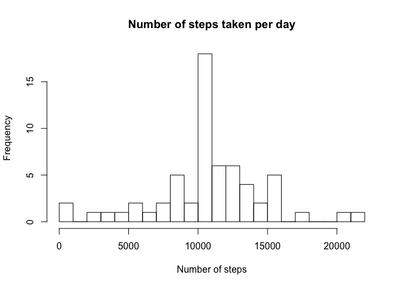

# Reproducible Research: Peer Assessment 1


## Loading and preprocessing the data


```r
rawdata <- read.csv("activity.csv")
rawdata$date <- as.Date(rawdata$date)
```

## What is mean total number of steps taken per day?


```r
## (Loading dplyr in a separate chunk because it produces a lot of messages on my system.)
library(dplyr)
```


```r
dailySums <- summarize(group_by(rawdata, date), sum(steps))
names(dailySums) <- c("date", "sum")
hist(dailySums$sum, breaks=20, main="Number of steps taken per day", xlab="Number of steps")
```

 

```r
mean(dailySums$sum, na.rm=TRUE)
```

```
## [1] 10766.19
```

```r
median(dailySums$sum, na.rm=TRUE)
```

```
## [1] 10765
```

## What is the average daily activity pattern?


```r
intervalAverage <- summarize(group_by(rawdata, interval), mean(steps, na.rm=TRUE))
names(intervalAverage) <- c("interval", "mean")

## Using mutate to make a smooth series of intervals (otherwise it jumps from 55 to 100 every hour)
intervalAverage <- mutate(intervalAverage,
                          fixedints = (floor(interval / 100) * 60) + (interval %% 100))
with(intervalAverage, plot(x=fixedints, y=mean, type="l",
     main="Number of steps per interval", xlab="Interval", ylab="Number of steps"))
```

 

## Imputing missing values


```r
## Calculate number of missing values.
sum(is.na(rawdata$steps))
```

```
## [1] 2304
```

```r
## Replace all the missing values with the mean number of steps for that interval
rawdatanona <- rawdata
rawdatanona$nona <- 0
for(i in 1:nrow(rawdatanona)) { 
  rawdatanona[i,]$nona <- ifelse(is.na(rawdatanona[i,]$steps),
   intervalAverage[intervalAverage$interval == rawdatanona[i,]$interval,]$mean,
   rawdatanona[i,]$steps)
}
## And repeat the earlier process to draw a new histogram
dailySumsNona <- summarize(group_by(rawdatanona, date), sum(nona))
names(dailySumsNona) <- c("date", "sum")
hist(dailySumsNona$sum, breaks=20, main="Number of steps taken per day", xlab="Number of steps")
```

 

```r
mean(dailySumsNona$sum, na.rm=TRUE)
```

```
## [1] 10766.19
```

```r
median(dailySumsNona$sum, na.rm=TRUE)
```

```
## [1] 10766.19
```

There is no difference in the mean, but a slight one in the median. It appears that NA values only appear when the entire day is nothing but NA values, so those days' sums are replaced with the mean value. That leaves no difference in the mean across days, but brings the median up to the mean.

## Are there differences in activity patterns between weekdays and weekends?


```r
## Create factor variable for weekday/weekend
rawdatanona$date <- as.Date(rawdatanona$date)
rawdatanona <- mutate(rawdatanona, day = weekdays(date))
rawdatanona <- mutate(rawdatanona, weekday =
               as.factor(ifelse(day %in% c("Saturday","Sunday"), "weekend", "weekday")))
## Calculate 5-minute interval averages for weekdays and for weekends
intervalWeekdays <- summarize(group_by(rawdatanona[rawdatanona$weekday == "weekday",], interval), mean(nona))
intervalWeekends <- summarize(group_by(rawdatanona[rawdatanona$weekday == "weekend",], interval), mean(nona))

## Make names more legible
names(intervalWeekdays) <- c("interval", "mean")
names(intervalWeekends) <- c("interval", "mean")

intervalWeekends <- mutate(intervalAverage,
                          fixedints = (floor(interval / 100) * 60) + (interval %% 100))
intervalWeekdays <- mutate(intervalAverage,
                          fixedints = (floor(interval / 100) * 60) + (interval %% 100))

## And make the plot!
par(mfrow=c(2,1), mar=c(2,2,2,2))
with(intervalWeekdays, plot(x=fixedints, y=mean, type="l", main="Weekdays"))
with(intervalWeekends, plot(x=fixedints, y=mean, type="l", main="Weekends"))
```

 
